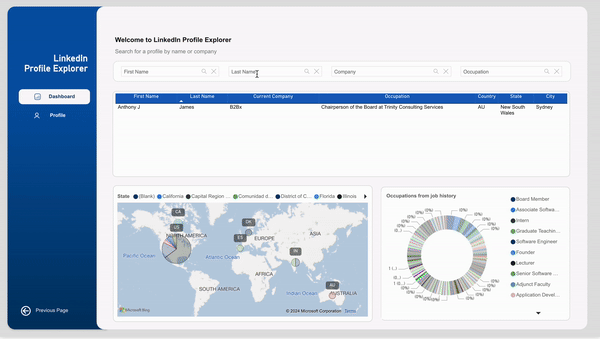

# LinkedIn Data Visualization Project

## Overview

This project aims to transform LinkedIn profile data from survey responses into a searchable and visual format using Pentaho for ETL (Extract, Transform, Load) processes and Power BI for data visualization. 

## Project Workflow

1. **Data Extraction**:
    - **LinkedIn Web/API/DB**: Accessing LinkedIn profiles through LinkedIn's Web API/DB using Proxycurl.

2. **File Storage**:
    - **LinkedIn Profile Photos**: Stored in `./output/profile-photo`.
    - **LinkedIn Profiles in JSON**: Stored in `./output/profile`.

3. **Database**:
    - **Datamarts**: Processed and loaded data is stored here, following normalization rules.

4. **Reporting and Analytics**:
    - **Visualization Tools**: Power BI and Tableau are used for creating interactive visualizations.

## Visualization Features

- **People Distribution by Geography**: Visualize the geographical distribution of LinkedIn profiles.
- **Occupation Variety**: Understand the diversity of occupations.
- **Job History Visualization**: View job histories with interactive maps and graphs.
- **Detail Drill-Through**: Switch from summary tables to detailed profiles.
- **Hover Details**: See additional information by hovering over data points.
